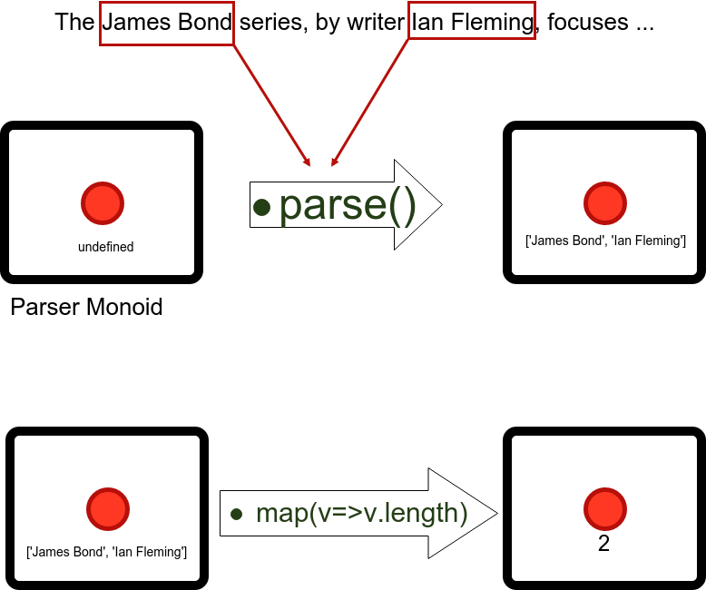

# Masala Parser
 
# Authors

* Didier Plaindoux
* Nicolas Zozol


# Origins

* Direct Style Monadic Parser Combinators For The Real World
* Haskell **Parsec**
* Existing: Jison, Bennu (Kephri) 


# Use cases (as today)

* Alternative for Lex & yacc
* Extract data from a big text, replace complex regexp
* Validate complete structure with variations
* Note taking with very customized markdown


Keywords: **variations** and **maintainability**


# Interesting points

* Works in the browser
* 400 unit & integration tests 
* 100% coverage
* API not stable at all (0.x)


# Quick Examples


... Live Demos 


# Explanations

## Floor notation

```js
// N: Number Bundle, C: Chars Bundle
import {stream, N,C} from 'parser-combinator';
const document = '|4.6|';

const floorCombinator= C.char('|')
                        .thenRight( N.numberLiteral )    // we had [ '|' , 4.6], we keep 4.6
                        .thenLeft( C.char('|') )   // we had [ 4.6 , '|' ], we keep 4.6
                        .map(x => Math.floor(x)); // we transform selected value in meaningful value

// Parsec needs a stream of characters
const parsing = floorCombinator.parse(stream.ofString(document));

console.log( parsing.value === 4 );
```


## Explanations

According to Wikipedia *"in functional programming, a parser combinator is a 
higher-order function that accepts several parsers as input and returns a new 
parser as its output."* 

## The Monoid structure

  

  


# Core bundles


* Streams
* Class `Parser
* What the `fold` ?
* Genlex

... Live demo


## The Flow Bundle
 
The flow bundle will mix ingredients together.

Most important:

* `F.try(parser).or(otherParser)` 
* `F.any`: Accept any character
* `F.not(parser)`: Accept anything else   
* `F.eos`: Accepted if the Parser has reached the **E**nd **O**f **S**tream

Others:

* `F.lazy`: Makes a lazy evaluation.
    - May be used for Left recursion   
* `F.returns`: forces a returned value 


## The Chars Bundle


* `letter`: accept an ascii letter (**opened issue**)
* `letters`: accepts many letters and returns a string
* `notChar(x)`: accept if next input is not `x`
* `char(x)`: accept if next input is `x`
* `lowerCase`: accept any next lower case inputs
* `upperCase`: accept any next uppercase inputs
*  ...

## The Numbers Bundle


* `numberLiteral`: accept any float number, such as -2.3E+24    
* `digit`: accept any single digit, and return a **single char** 
* `digits`: accept many digits, and return a **string**.
* `integer`: accept any positive or negative integer


# The Standard bundles

## Under development

* These bundles are under development
* They will move with the first use cases implementations
* 2 paying clients
    - Extractor
    - Markdown (quick notes)

## The Token Bundle


* `email`: accept a very large number of emails
* `date`: 2017-03-27 or 27/03/2017
* `blank(nothing|string|parser)`: 
    - accept standard blanks (space, tab)
    - or defined characters
    - or a combined Parser
* `eol`: accept **E**nd **O**f **L**ine `\n` or `\r\n`

## The Extractor Bundle

* Find valuable data in complex text
    - emails sent by platforms
    - website crawling...
* The `X` is a class to make customization easy

### X constructor

`const x = new X(options)` with default options to:

        {
            spacesCharacters:' \n',
            wordSeparators:C.charIn(' \n:-,;'),
            letter : C.letter,
            moreSeparators: null
        }


## JSON Bundle and Markdown Bundle

* Total Customization of the markdown parser 
